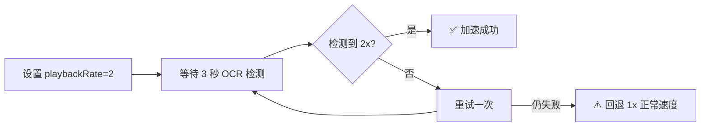

# auto_xxt_chrome_web — 学习通自动刷课脚本 (OCR 版)

基于 **OCR 文字识别** + **PyAutoGUI 模拟操作**的半自动刷课脚本。无需截图模板，自动识别屏幕上的中文按钮文字，模拟真人观看视频、自动静音播放、调整速度、处理弹窗、跳转下一节。

## 目录

- [环境要求](#环境要求)
- [安装步骤](#安装步骤)
- [首次使用](#首次使用)
- [命令行参数](#命令行参数)
- [运行原理](#运行原理)
- [常见问题](#常见问题)
- [注意事项](#注意事项)

---

## 环境要求

| 项目 | 要求 |
|------|------|
| 操作系统 | Windows 10 或 11 |
| Python | 3.10 或更高 |
| 浏览器 | Google Chrome |
| 学习通 | https://i.chaoxing.com |
| Tesseract OCR | 需安装并包含中文语言包 |

---

## 安装步骤

### 1. 安装 Tesseract OCR 引擎

脚本依赖 Tesseract 识别屏幕上的中文字。如果未安装，请下载安装：

- 下载地址: https://github.com/UB-Mannheim/tesseract/wiki
- 安装时勾选 **Chinese (Simplified)** 语言包（或安装后手动添加 `chi_sim.traineddata`）
- 默认路径: `C:\Program Files\Tesseract-OCR\tesseract.exe`

安装后确认中文包可用：

```bash
tesseract --list-langs
# 输出中应有 chi_sim
```

### 2. 克隆项目并配置

```bash
git clone git@github.com:123ewk/auto_xxt_chrome_web.git
cd auto_xxt_chrome_web
```

### 3. 虚拟环境

```bash
# Windows CMD:
python -m venv .venv
.venv\Scripts\activate

# PowerShell:
.venv\Scripts\Activate.ps1

# Git Bash:
source .venv/Scripts/activate
```

### 4. 安装依赖

```bash
pip install -r requirements.txt
```

### 5. 配置 Tesseract 路径（如需要）

如果 Tesseract 安装路径不是 `D:\Tesseract_OCR\tesseract.exe`，编辑 `config.py` 修改 `TESSERACT_CMD`：

```python
TESSERACT_CMD = r"C:\Program Files\Tesseract-OCR\tesseract.exe"
```

或者设置环境变量：

```bash
set TESSERACT_CMD=C:\Program Files\Tesseract-OCR\tesseract.exe
```

---

## 首次使用

```bash
# 激活虚拟环境
source .venv/Scripts/activate

# 直接运行（无需截图模板）
python main.py
```

脚本会自动检测 OCR 引擎是否可用，然后进入 5 秒倒计时，切换到 Chrome 窗口即可。

### 播放速度调整

```bash
# 1.5 倍速
python main.py --speed 1.5

# 2 倍速（默认）
python main.py --speed 2.0
```

### 延长准备时间

```bash
# 10 秒倒计时
python main.py --countdown 10
```

---

## 命令行参数

| 参数 | 作用 | 默认值 | 说明 |
|------|------|--------|------|
| `--speed` | 播放倍速 | 2.0 | 设为 1.0 则正常速度。加速失败会自动降级 |
| `--countdown` | 启动倒计时秒数 | 5 | 脚本开始操作前的等待时间 |

示例：

```bash
python main.py --speed 1.5 --countdown 8
```

### 紧急停止

- **Ctrl+C** — 终端中按 Ctrl+C 安全停止
- **鼠标移到屏幕左上角** — 触发 PyAutoGUI 保护机制停止

---

## 运行原理

### 核心技术

脚本用 Tesseract OCR 识别屏幕上的中文字，替代传统模板匹配：

```
屏幕截图 (PIL/pyautogui)
        ↓
Tesseract OCR (chi_sim+eng)
        ↓
解析文字位置 (x, y, 宽, 高)
        ↓
找到目标文字 → 计算中心坐标 → 点击
```

### 整体流程

```
手动打开 Chrome → 学习通课程页面 → 运行 python main.py
                            ↓
                    OCR 引擎检测 ✓
                            ↓
                    5 秒倒计时（切换到 Chrome）
                            ↓
              ┌───────────────────────────────┐
              │ 第 1 步: 弹窗检测（OCR）         │
              │   · 扫描屏幕上的"确定"/"取消"/"×" │
              │   · 找到后计算坐标并点击          │
              └───────────────────────────────┘
                            ↓
              ┌───────────────────────────────┐
              │ 第 2 步: 视频控制（DevTools）     │
              │   · Ctrl+Shift+I 打开 DevTools  │
              │   · 注入 video.play()           │
              │   · 注入 video.muted = true     │
              │   · 注入 video.playbackRate = 2 │
              └───────────────────────────────┘
                            ↓
              ┌───────────────────────────────┐
              │ 第 3 步: 监控进度（OCR）          │
              │   · 每 5 秒 OCR 扫描一次         │
              │   · 检测"下一节"/"继续"等文字     │
              │   · 超时保护: 最多等 10 分钟      │
              └───────────────────────────────┘
                            ↓
              ┌───────────────────────────────┐
              │ 第 4 步: 导航（OCR）              │
              │   · OCR 找"下一节"→ 点击         │
              │   · 或找"返回课程"→ 点击          │
              └───────────────────────────────┘
                            ↓
                    ↻ 回到第 1 步 ↻
                            ↓
                检测到"已完成全部任务" → 结束
```

### 加速降级

学习通部分视频限制倍速播放，脚本自动处理：



### 模块说明

| 模块 | 作用 |
|------|------|
| `core/ocr.py` | OCR 核心：截图→识别文字→返回坐标。提供 `find_text()`、`click_text()`、`wait_for_text()` 等接口 |
| `core/console.py` | Chrome DevTools 注入 JS：控制视频播放、静音、调速 |
| `core/clicker.py` | 点击封装 |
| `actions/video.py` | 视频逻辑：播放、静音、加速、监控完成 |
| `actions/navigation.py` | 导航逻辑：OCR 找"下一节"并点击 |
| `actions/popup.py` | 弹窗处理：OCR 找"确定"、"取消"并点击 |

---

## 常见问题

### Q: 运行后提示 Tesseract 不可用？

```bash
# 确认安装路径，检查 config.py 中的 TESSERACT_CMD 是否正确
python -c "import pytesseract; print(pytesseract.__version__)"
# 确认中文语言包
"D:\Tesseract_OCR\tesseract.exe" --list-langs
```

### Q: 脚本找不到"下一节"按钮？

- 按钮可能在当前屏幕可视区域之外，尝试向下滚动
- 如果按钮颜色和背景相近，OCR 可能识别不到，可以降低 `config.py` 中的 `OCR_MIN_CONF`

### Q: 视频加速无效？

- 这是学习通的限制，脚本会自动降级到 1x 正常速度继续运行
- 查看 `logs/session.log` 确认降级原因

### Q: 弹窗没被处理？

- OCR 识别需要弹窗中的文字清晰可见
- 如果弹窗很小或字体模糊，可以在 `config.py` 的 `POPUP_CONFIRM_TEXTS` 中添加更多关键词

---

## 目录结构

```
sua_ke/
├── main.py                  # 程序入口
├── config.py                # 全局配置（Tesseract 路径、OCR 阈值等）
├── requirements.txt         # 依赖列表
├── README.md                # 本文件
├── actions/
│   ├── video.py             # 视频控制（DevTools JS 注入）
│   ├── navigation.py        # 章节导航（OCR）
│   └── popup.py             # 弹窗处理（OCR）
├── core/
│   ├── ocr.py               # OCR 引擎（Tesseract 封装）
│   ├── console.py           # Chrome DevTools 控制
│   ├── screenshot.py        # 截图工具
│   └── clicker.py           # 点击封装
├── templates/               # （空，OCR 方案无需模板）
├── docs/plans/
│   └── 2026-05-13-auto-learning-design.md
└── logs/
    └── session.log          # 日志文件
```

---

## 注意事项

1. **运行期间不要遮挡屏幕** — OCR 需要看到完整的屏幕内容才能识别文字
2. **同一分辨率下使用** — 如果外接了显示器或改变了分辨率，不影响 OCR（无需重新配置）
3. **登录操作手动完成** — 脚本不处理登录，避免账号风险
4. **不要做考试/作业** — 本脚本仅用于自动观看视频章节
5. **建议使用前查看日志** — `logs/session.log` 记录了每次操作的详细信息
6. **超时保护** — 每个视频最多等待 10 分钟，超时自动跳过
7. **加速降级是正常行为** — 部分视频无法加速，脚本自动处理
